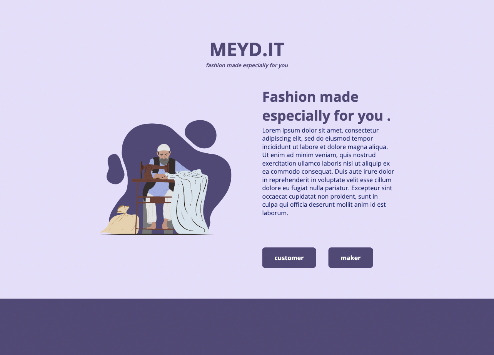
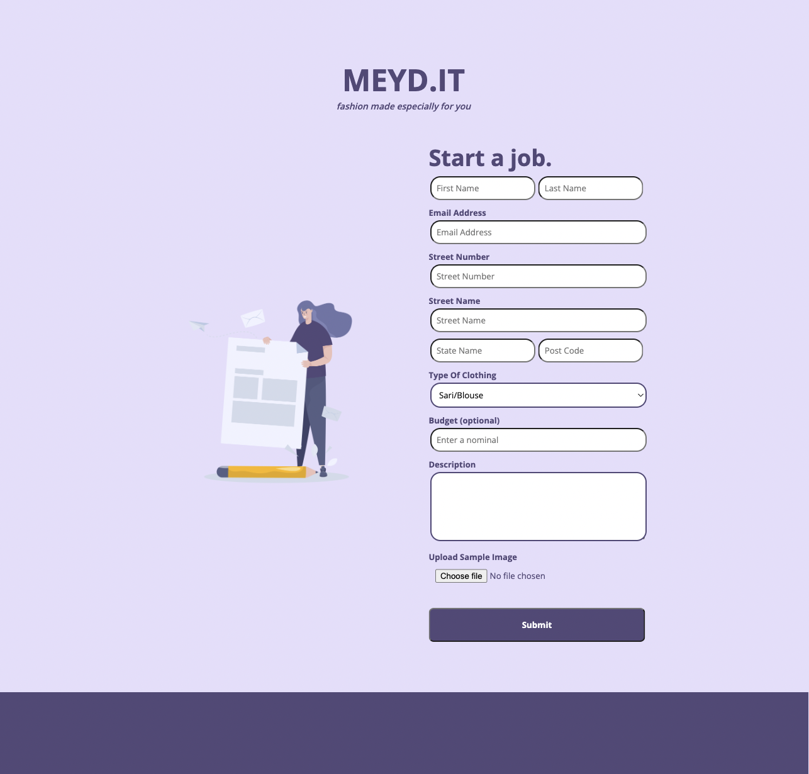
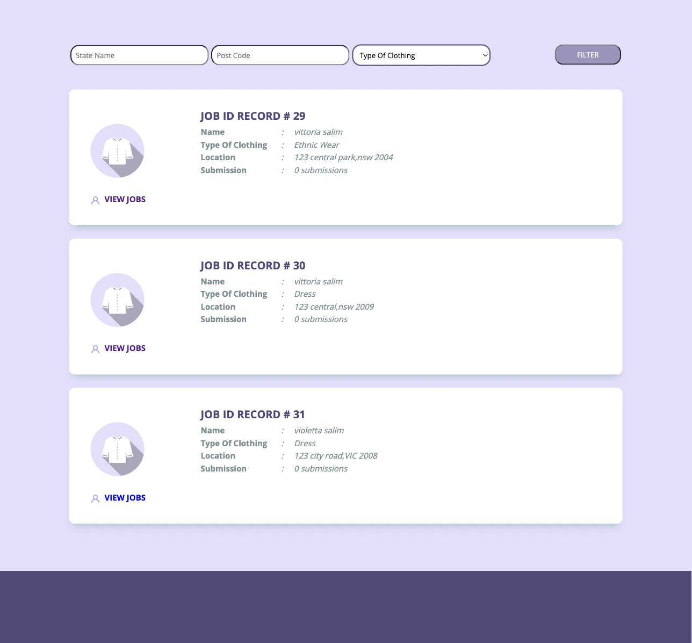
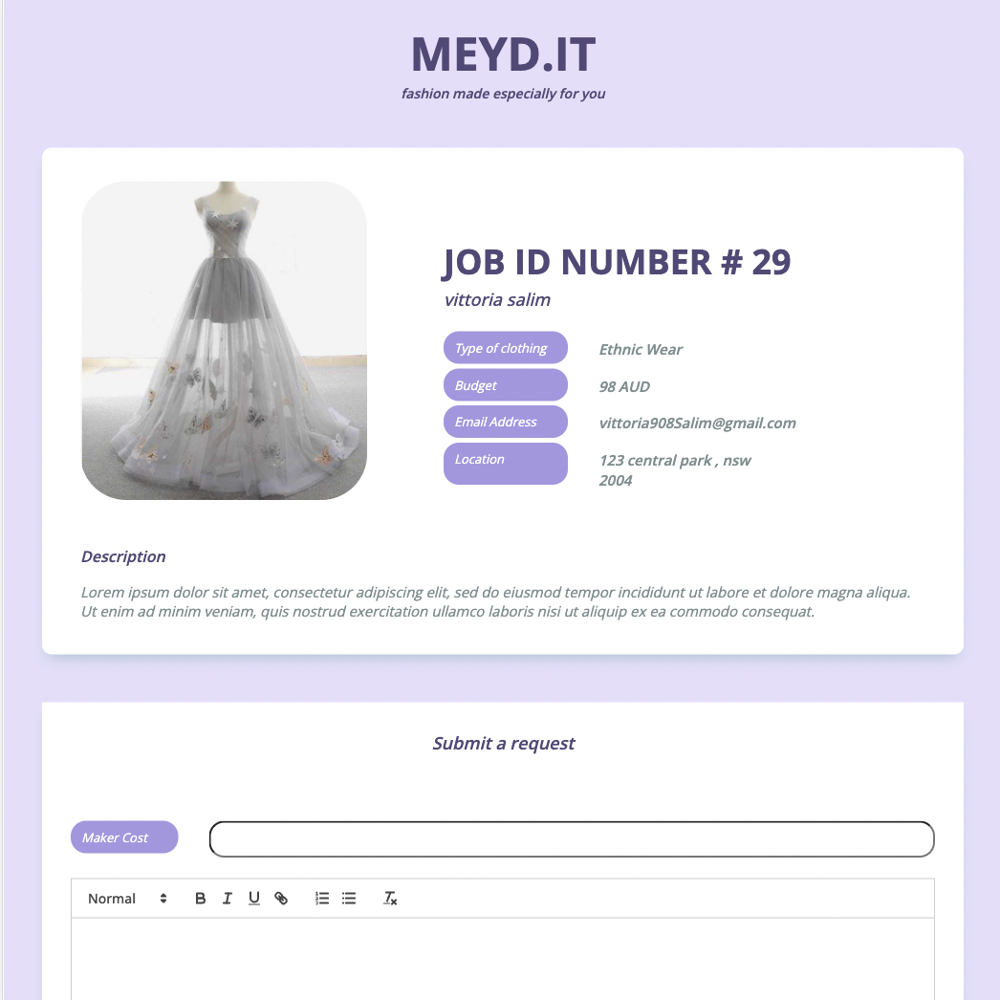
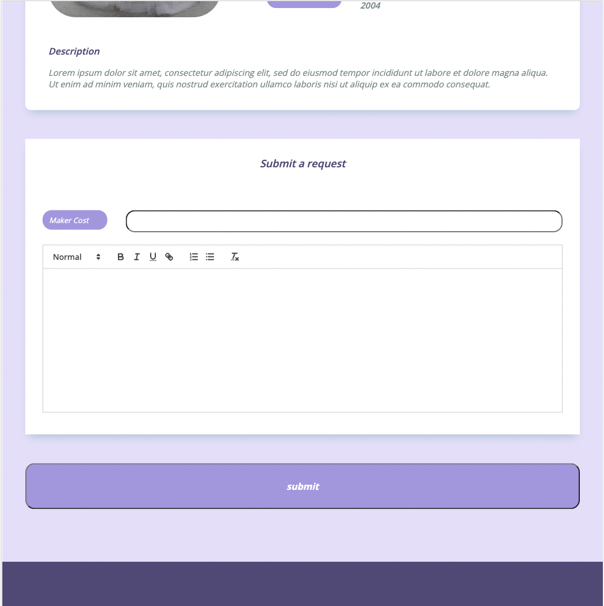

# Meyd-mini-project

Full-Stack mini-project app

## 🖥️ Tech Stack

**Frontend:**

&nbsp;
&nbsp;

**Backend:**

&nbsp;
&nbsp;
&nbsp;

## 🚀 Features

- Home Page : redirection customer and make site
- Customer Page : 
    - Post a job 
    - upload image , dress details and customer details
- Maker Page :
    - View all jobs posted by customer
    - filter jobs based on location and clothing types
    - send job request and bid via email

## Home Page 🙈 :

## Post Job 🙈 :

## View Job 🙈 :

## Submission Job 🙈 :

## Send Job Request 🙈 :

<h2>📬 Contact</h2>

If you want to contact me, you can reach me through below handles.

© 2023 Vittoria Salim

